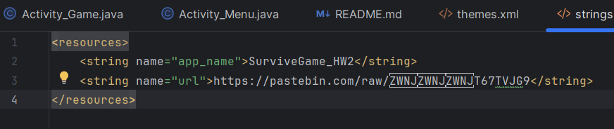
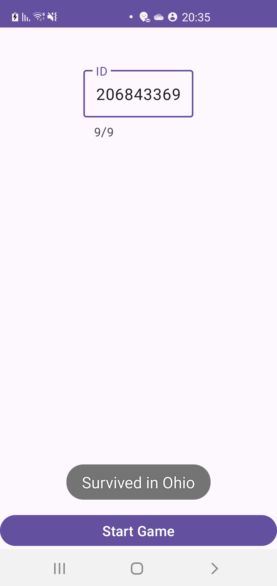

# 🧠 Survive Game - Reverse Engineering

This project involves reverse engineering a game application that was decompiled from an APK file.  
The goal was to understand how the application works, fix errors, and successfully run the game according to the logic in the code.

## 🔧 Work Process

### 1. Code Decompilation
- We received an APK file.
- We performed decompilation.
- Search for files: Java files, XML, and AndroidManifest.

### 2. Import to Source Code in Android Studio Project
- I imported the following files:
    - `AndroidManifest.xml`
    - `Activity_Menu.java`
    - `Activity_Game.java`
    - `activity_menu.xml`
    - `activity_game.xml`

## 🛠️ Fixes Made to AndroidManifest.xml

| Problem | Solution |
|---------|----------|
| Package name mismatch | Matched to class names in the code (`com.example.survivegame_hw2`) |
| Missing `android:exported="true"` | Added to Activity with `intent-filter` |
| Use of platformBuildVersionCode / Name | Removed — not valid |
| `appComponentFactory` requiring API 28+ | Removed to avoid requiring high minSdk |
| `targetSdkVersion` too low | Updated to 34 according to Google Play requirements |

## 🐞 Fixing Code Errors

### 📄 Activity_Game.java

#### ❌ Error: Improper use of Toast

- **Explanation**: The code included a call to `Toast.makeText()` with a hardcoded numeric value (`1`) as the duration parameter.  
  Although `1` equals `Toast.LENGTH_LONG`, according to the Android API, only constants should be used (`Toast.LENGTH_SHORT` or `Toast.LENGTH_LONG`).  
  Using hardcoded numeric values causes Lint errors and is not standard.

- **Code before fix**:
  ```java
  Toast.makeText(this, "Survived in " + state, 1).show();
  Toast.makeText(this, "You Failed ", 1).show();
  ```

- **Code after fix**:
  ```java
  Toast.makeText(this, "Survived in " + state, Toast.LENGTH_SHORT).show();
  Toast.makeText(this, "You Failed ", Toast.LENGTH_SHORT).show();
  ```

### 📄 Activity_Menu.java

#### ❌ Error: `Cannot resolve symbol 'url'`
- **Explanation**: A value named `url` was not defined in the `strings.xml` file.
- **Solution**:
  I added the following line to `res/values/strings.xml`:
  ```xml
  <string name="url">https://pastebin.com/raw/T67TVJG9</string>
  ```

#### ❌ Zero-width characters in the URL

- **Explanation**: Hidden characters were introduced into the URL during copying. These characters are invisible to the eye but cause the server reading to crash and connection errors.

  For example, in the following image from Android Studio, you can see the invisible characters that appeared after pasting the address:

  

- **Solution**:
  I manually typed the address I found in the folder.

## 🕹️ How the Game Works

After reviewing and analyzing the code, I understood that the application includes two main screens:

### 1. `Activity_Menu` – Opening Screen

1. The user enters a 9-digit ID number in a text field.
2. A call to the server is made using the function:
   ```java
   getJSON()
   ```
3. The response from the server is a string of states containing names of US states, separated by commas:
   `California,Texas,Florida,New York,Illinois,Pennsylvania,Ohio,Washington,Michigan,Arizona`

   The string is split into an array of strings using the function:
   ```java
   String[] allStates = data.split(",");
   ```

   This creates an array of size 10, where each index represents a state in order:
    - 0: California
    - 1: Texas
    - 2: Florida
    - 3: New York
    - 4: Illinois
    - 5: Pennsylvania
    - 6: Ohio
    - 7: Washington
    - 8: Michigan
    - 9: Arizona

4. The seventh digit in the ID (at position id.charAt(7)) is used as an index to select a state from the string.

### 2. `Activity_Game` – Game Screen

1. There are 4 buttons: ⬅️ ➡️ ⬆️ ⬇️ (left, right, up, down)
2. The code performs a calculation:
   ```java
   steps[i] = Character.getNumericValue(id.charAt(i)) % 4;
   ```
3. Matching arrow → Translated to a value between 0–3 → Each digit in the ID
4. A message "Survived in {state}" appears → If everything is correct

#### 🔎 Example: ID number `206843369`

The steps calculation is performed by the operation `mod 4` on each digit of the ID:

| ID Index | Digit | Digit % 4 | Matching Arrow |
|----------|-------|-----------|---------------|
| 0        | 2     | 2         | ⬆️ Up         |
| 1        | 0     | 0         | ⬅️ Left       |
| 2        | 6     | 2         | ⬆️ Up         |
| 3        | 8     | 0         | ⬅️ Left       |
| 4        | 4     | 0         | ⬅️ Left       |
| 5        | 3     | 3         | ⬇️ Down       |
| 6        | 3     | 3         | ⬇️ Down       |
| 7        | 6     | 2         | ⬆️ Up         |
| 8        | 9     | 1         | ➡️ Right      |

**Required Button Sequence:**
⬆️ ⬅️ ⬆️ ⬅️ ⬅️ ⬇️ ⬇️ ⬆️ ➡️

## 🎮 Success Screenshot

Below is a screenshot showing the success message "Survived in Ohio" after correctly entering the sequence:




